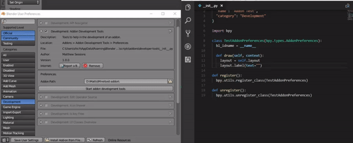

# Blender Addon Development Tools

An addon for giving you some productivity gains while developing an addon. After selecting the folder where the addon you want to work on is, the development tools will install your addon and then watch for file changes in your addon folder. When a change is detected, the development tools will sync your changes from your addon to blender and reload your addon so that you can see your changes in blender immediately.

